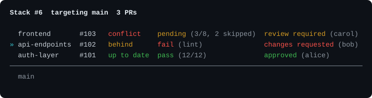

# gh-stack-status

A [GitHub CLI](https://cli.github.com/) extension that lists each pull request in a GitHub **stack**, with CI check rollup and reviewer status for every layer.



GitHub CLI extensions cannot add subcommands to another extension, so this is `gh stack-status`, not `gh stack status`. It does not wrap `gh stack view` and does not read `.git/gh-stack`. It uses the GitHub Stacks GraphQL/REST APIs, so only stacks that exist on GitHub are shown.

## Install

```sh
gh extension install morrislaptop/gh-stack-status
```

To work from a local clone instead, clone into a directory whose name starts with `gh-`, which GitHub CLI requires:

```sh
git clone https://github.com/morrislaptop/gh-stack-status.git
cd gh-stack-status
gh extension install .
```

Requires [GitHub CLI](https://cli.github.com/) (`gh`) authenticated to a host that supports stacked pull requests.

## Usage

Run it from a checkout of the repository that owns the stack:

```sh
gh stack-status
gh stack-status --short
gh stack-status --json
gh stack-status 6
gh stack-status 102
gh stack-status https://github.com/OWNER/REPO/pull/102
gh stack-status api-endpoints
```

With no argument, the extension finds the pull request for the current branch and loads that PR’s stack.

A bare number is tried as a **stack number** first, then as a **pull request number**.

### Output

```
Stack #6  targeting main  3 PRs

  frontend       #103   pending (3/8, 2 skipped)  review required (carol)
» api-endpoints  #102   fail (lint)               changes requested (bob)
  auth-layer     #101   pass (12/12)              approved (alice)
─────────────────────────────────────
  main
```

The listing is top of stack first (furthest from trunk), then trunk at the bottom — the same orientation as `gh stack view`. `»` marks the currently checked-out branch.

Color follows the usual GitHub CLI rules: it is on for terminals and off when piped, and honours `NO_COLOR`, `CLICOLOR_FORCE`, and `GH_FORCE_TTY`.

**Checks** come from `statusCheckRollup` on each pull request:

| State | Display |
|-------|---------|
| all complete and passing | `pass (passed/total)` |
| any failing | `fail` plus up to three failing check names |
| any still running | `pending (passed/total)` |
| no checks | `—` |

Neutral and skipped checks are reported separately as `N skipped` and are left out of the total, so the counts line up with `gh pr checks`.

Repeated runs of the same check are collapsed to the most recent run, keyed by check name and workflow. This matters because `statusCheckRollup.state` counts superseded runs: when a job is cancelled and re-run, GitHub keeps the cancelled run in the rollup and reports `FAILURE` even though the PR is green in the web UI. The extension derives the state from the de-duplicated checks instead.

**Reviews** use `reviewDecision`, plus latest reviews and outstanding review requests:

| Decision | Display |
|----------|---------|
| `APPROVED` | `approved` and who approved |
| `CHANGES_REQUESTED` | `changes requested` and who requested changes |
| `REVIEW_REQUIRED` | `review required` and pending reviewers |
| none (for example drafts) | `—` |

`--short` prints one line per PR: number, checks, reviews.

`--json` prints bottom-to-top stack data (position 1 first), including check counts, failed names, and reviewer logins. Suitable for scripts.

## Develop

```sh
go test ./...
go build -o gh-stack-status
gh extension install .
gh stack-status --help
```

Precompiled binaries for releases are built by [cli/gh-extension-precompile](https://github.com/cli/gh-extension-precompile) in `.github/workflows/release.yml`.
